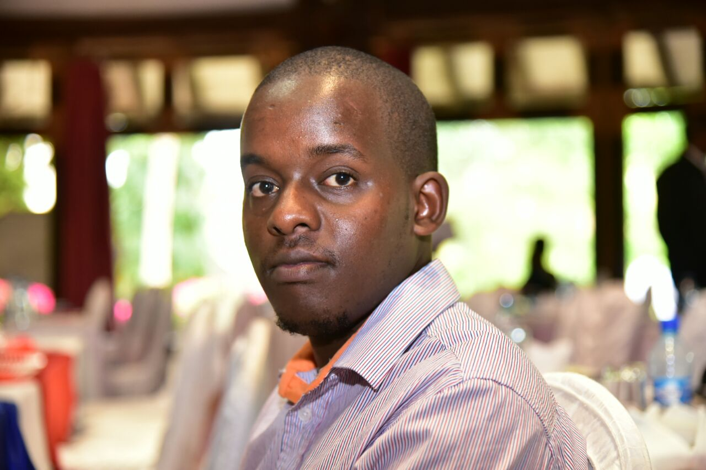

	

		<ul class="nav"  style="float:left">
			<li><a target="_blank" href="{{ BASE_PATH }}/assets/brianmaiyocv.pdf">CV</a></li>
			<li><a target="_blank" href="https://github.com/briankip">Github</a></li>
			<li><a target="_blank" href="https://www.linkedin.com/in/brian-maiyo-0baa95b4/">LinkedIn</a></li>
			<li><a target="_blank" href="https://stackoverflow.com/users/536434/briankip">StackOverflow</a></li>
		</ul>
	

	

		An adaptable, results driven and hardworking individual. Learns fast and work well leading teams or being part of a team. Excels in tackling challenging problems using innovation and proper planning. 
		Has extensive experience in design, implementation and management of software development projects. Able to understanding business problems, communicate effectively to stakeholders and complete project objectives in a timely manner.
	

	
	

